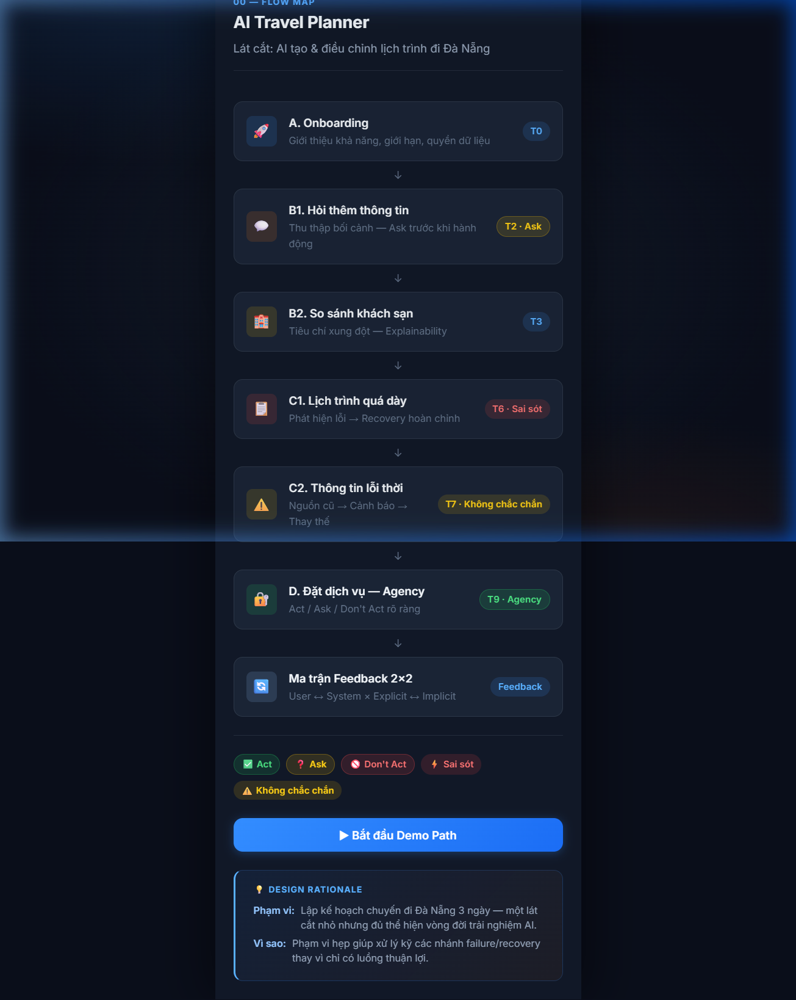
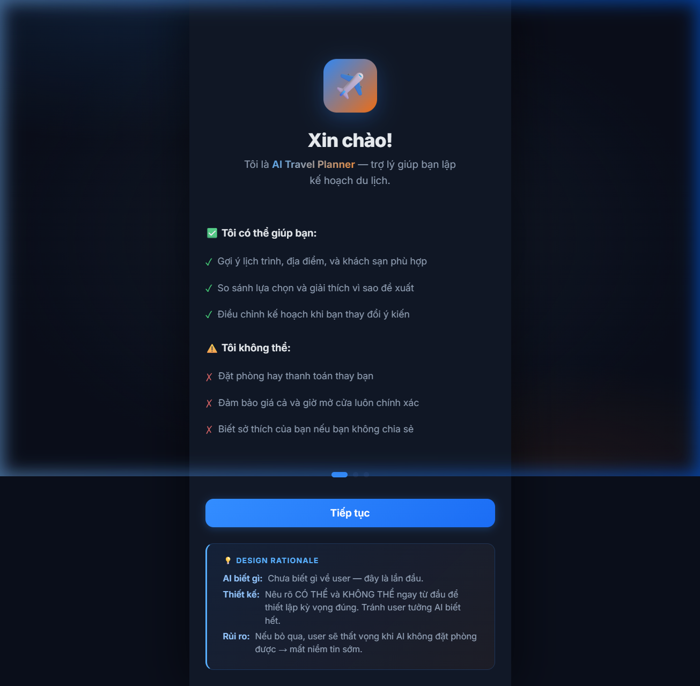
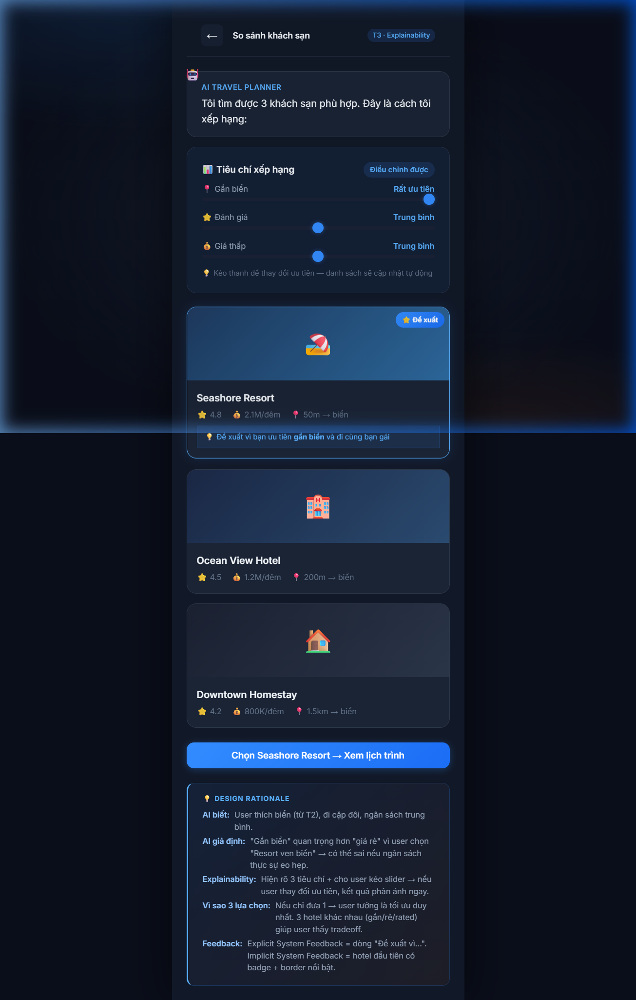
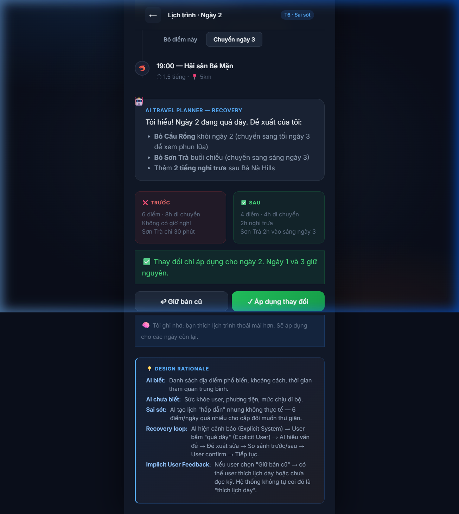
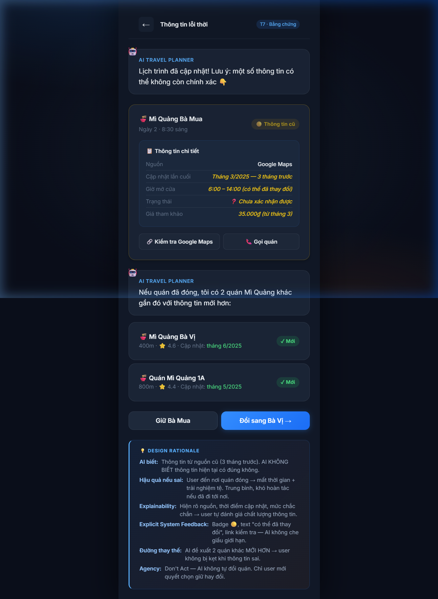

# Day18 — Track 1: AI Travel Planner

> **Bài thực hành Ngày 18 — Human-Centered AI Design**
> VinUni AI20k · Batch 02

## 📌 Thông tin nhóm

| Tên | MSSV |
|-----|------|
|   **Đỗ Tuấn Đạt**  |  2A202600818    |
|  **Hoàng Hiếu Trung**   |  2A202600702    |
|  **Đàm Xuân Giáp**   |    2A202600740  |

---

## 🎯 Tóm tắt

**Track**: AI Travel Planner
**Lát cắt tính năng**: AI tạo & điều chỉnh lịch trình cho chuyến đi **Đà Nẵng 3 ngày**

Prototype thể hiện trải nghiệm AI khi AI **không hoàn hảo** — sai sót, không chắc chắn, cần phản hồi và quyền kiểm soát từ người dùng.

---

## 🚀 Cách chạy

```bash
# Mở terminal tại thư mục project
cd "Day18-track1-lab"

# Khởi tạo server
python -m http.server 8080

# Mở browser tại
# http://localhost:8080
```

Hoặc mở trực tiếp file `index.html` trong browser.

---

## 📁 Cấu trúc thư mục

```
Day18-track1-lab/
├── index.html                  ← Prototype chính (11 screens, gồm Demo Path)
├── css/
│   └── styles.css              ← Design system
├── js/
│   └── app.js                  ← Logic tương tác
├── assets/
│   └── screenshots/            ← Ảnh chụp từng screen
├── WALKTHROUGH.md              ← Hướng dẫn chi tiết + hình ảnh
└── README.md                   ← File này
```

---

## 🗺️ Flow Map — Tổng quan



| # | Screen | Kịch bản | Năng lực |
|---|--------|----------|----------|
| 00 | Flow Map | — | Tổng quan phạm vi |
| 01 | Onboarding | T0 | Kỳ vọng, quyền, giới hạn AI |
| 02 | Hỏi thêm thông tin | T2 | Ask — thu thập bối cảnh |
| 03 | So sánh khách sạn | T3 | Explainability — tiêu chí xếp hạng |
| 04 | Lịch trình + Recovery | T6 | Sai sót → Phản hồi → Khôi phục |
| 05 | Thông tin lỗi thời | T7 | Bằng chứng, nguồn, thay thế |
| 06 | Đặt dịch vụ | T9 | Act / Ask / Don't Act |
| 07 | Demo Path | — | Script 5 phút để chạy đúng các nhánh |
| 08 | Ma trận Feedback | — | 2×2: Explicit & Implicit × User & System |

---

## ✅ Checklist yêu cầu bài lab

| Yêu cầu | ✓ | Ở đâu |
|----------|---|-------|
| Onboarding lần đầu | ✅ | Screen 01 (3 bước) |
| ≥ 4 kịch bản ngoài onboarding | ✅ | T2, T3, T6, T7, T9 (5 kịch bản) |
| Lát cắt Onboarding → During → After → Feedback | ✅ | Flow liên tục |
| Đủ Act / Ask / Don't Act | ✅ | Screen 06 |
| ≥ 1 vòng feedback & recovery | ✅ | Screen 04 |
| Đủ 4 loại feedback (ma trận 2×2) | ✅ | Ma trận Feedback, có 8 câu rationale/ô |
| ≥ 1 lớp bằng chứng / giải thích | ✅ | Screen 05 + 03 |
| Design rationale đặt cạnh flow | ✅ | 10 câu hỏi/kịch bản |
| Demo Path trong prototype | ✅ | Screen 07 |

---

## 🔐 Agency Design

| Hành động | Mức độ | Lý do |
|-----------|--------|-------|
| Tóm tắt thông tin chuyến đi | ✅ Act | Rủi ro thấp, dễ kiểm tra |
| Gợi ý loại phòng | ❓ Ask | Giả định quan trọng, cần user duyệt |
| Thanh toán & đặt chỗ | 🚫 Don't Act | Tài chính, khó hoàn tác |

---

## 📊 Ma trận Feedback 2×2

|  | Explicit | Implicit |
|---|---|---|
| **User → System** | Bấm "Ngày này quá dày", chọn "Đổi quán", kéo slider tiêu chí | Bỏ qua hotel rẻ, xem lâu mục ăn uống, bấm "Giữ bản cũ" |
| **System → User** | "6 điểm — 8h di chuyển", "Thông tin từ tháng 3/2025", "Đề xuất vì gần biển" | Badge 🟡 nhấp nháy, nút disabled + tooltip, chip sáng lên |

---

## 📸 Screenshots

> Xem chi tiết tại [WALKTHROUGH.md](WALKTHROUGH.md)

| Onboarding | Hỏi thêm | Khách sạn |
|:---:|:---:|:---:|
|  |  |  |

| Lịch trình | Recovery | Thông tin cũ |
|:---:|:---:|:---:|
|  |  |  |

| Đặt dịch vụ (Agency) | Feedback 2×2 |
|:---:|:---:|
|  |  |

---

## 🛠️ Công nghệ

- **HTML5** — Cấu trúc prototype
- **CSS3** — Dark mode, glassmorphism, micro-animations
- **Vanilla JavaScript** — Navigation, interactions, recovery flow
- **Google Fonts** — Inter

---

## 📄 License

Bài lab thuộc khoá VinUni AI20k · Batch 02 · Day 18

---

# 🪝 Day 20 — Retention, Engagement & Habit Loop

> Mở rộng prototype Ngày 18 (không tạo sản phẩm mới). Truy cập từ **Flow Map → nút "🪝 Day 20 — Retention & Habit"**, hoặc mở screen `screen-day20-hub`.

## ⚠️ Nhận định nền tảng
Lập kế hoạch chuyến đi là use case **tần suất thấp / theo dịp** (2–4 chuyến/năm), bao quanh một giai đoạn **in-trip 3 ngày tần suất cao**. Toàn bộ bài tuân thủ nguyên tắc: **không ép use case frequency thấp thành habit hằng ngày** — thay vào đó khai thác giai đoạn in-trip + nurture theo mùa vụ (logic Zillow/Zestimate).

## 📦 Đầu ra bắt buộc (đều nằm trong prototype)
| # | Deliverable | Screen |
|---|-------------|--------|
| 01 | Customer Retention Canvas (Problem · Persona · Anti-persona · Why · Alternative · Frequency) | `screen-d20-canvas` |
| 02 | Core Action · Active User | `screen-d20-core` |
| 03 | Natural Frequency → Retention Metric (returning-traveler retention, **không** D1/D7) | `screen-d20-metric` |
| 04 | Onboarding Audit + Current State (Keep/Remove/Delay/Simplify) | `screen-d20-audit` |
| 05 | Redesigned Onboarding → First Core Action + Activation/TTV | `screen-d20-redesign` |
| 06 | Before/After & Recovery Path | `screen-d20-beforeafter` |
| 07 | Measurement Ladder | `screen-d20-ladder` |
| 08 | North Star & Input Metrics (leading vs lagging + trade-off) | `screen-d20-northstar` |
| 09 | Nature vs Nurture | `screen-d20-nature` |
| 10 | Hook Review (có bước kiểm tra "có cần habit không") | `screen-d20-hook` |
| 11 | Metric Tracking Requirement (event · properties · acceptance criteria) | `screen-d20-tracking` |
| 12 | Demo Path 8 phút | `screen-d20-demo` |

## ✏️ Phần chỉnh sửa prototype Ngày 18 (chạy tương tác thật)
Flow onboarding **value-first** mới + **in-trip companion** (Hook loop):
`screen-nf-setup` → `screen-nf-draft` (AI tự bắt lỗi → **First Core Action: lưu lịch**) → `screen-intrip` (Up Next), kèm recovery `screen-nf-recover`.

**Tóm tắt thay đổi:** bỏ permission & chọn khách sạn khỏi đường tới value · 7 trường → 3 chip · TTFCA ~4–5 phút → <90s · evidence-of-value hiện ngay sau core action · +1 recovery path.
